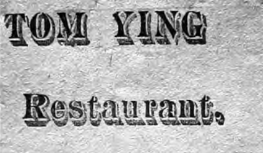

  <h1>Chinese Ordered to 'Git' in Territorial New Mexico</h1>
  
  <figcaption>
    Tom Ying’s restaurant notice shows the local business identity hidden by newspaper labels such as “the Chinese.”
    <cite>Source: Reproduced in Garland D. Bills, “Tom Ying: The Hard Life of an Early Chinese Immigrant in New Mexico,” <em>La Crónica de Nuevo México</em>, no. 119 (Fall 2023): 3.</cite>
  </figcaption>
  
An 1885 Silver City notice shows how newspapers made Chinese residents seem removable.

# Introduction

On December 3, 1885, the Golden Era, a Lincoln, New Mexico, newspaper, printed a notice from Silver City: “The citizens of Silver City have had a round-up among the Chinese, and have ordered them to ‘git.’”¹ Though short, this sentence records an attempt to expel Chinese residents and uses language that implies routine action.

This page argues that the Silver City notice demonstrates how newspaper language actively denied the Chinese of recognition as legitimate community members in New Mexico. It functions as evidence of civic unmaking: by referring to the entire group as "the Chinese" and juxtaposing them with "citizens," the notice constructs Chinese residents as outsiders, vulnerable to expulsion. This process is key in forming AANHPI and New Mexico history because it made the exclusion and delegitimization of Chinese residents visible through common reporting.

First, we’ll take a close look at the Golden Era notice, especially the words “citizens,” “round-up,” and “git.” Next, we’ll compare this notice to other articles in the same newspaper issue to highlight how Chinese residents were represented differently. After that, it puts the Silver City notice alongside reports from Deming, Socorro, Raton, and Central City, tracking patterns of anti-Chinese pressure, labor needs, population counts, protection, and legal vulnerability. Finally, it connects these local stories to the larger history of Chinese exclusion in the West and to historians’ later attempts to recover the lives of individual Chinese New Mexicans from scattered records.

## The Meaning of “Round-Up”

Looking at the language, “round-up” is the strongest word in the notice. The same issue of the Golden Era is filled with stock brands, cattle marks, ranch notices, and other livestock topics. This context is important. The word “round-up” comes straight from animal management, referring to gathering, controlling, and moving animals. While we can’t say that Chinese residents were literally treated like cattle, what matters is that the newspaper chose animal-management language to describe them.

The word choice could have shaped community attitudes. It invited readers to see anti-Chinese action as community management. When Chinese residents were described in terms of livestock control, sending them away could seem less like rejecting neighbors and more like handling a local problem. The word “round-up” made exclusion sound familiar, practical, and civic.

The sentence makes it clear who has power and who does not. “The citizens of Silver City” take action, while “the Chinese” are simply acted upon. There’s no mention of courts, sheriffs, laws, or trials. The word “git” is blunt and dismissive. Together, “round-up” and “git” make forced removal sound like an ordinary, common-sense action, not a violation of rights.

This sentence takes anti-Chinese hostility and puts it in the language of civic action. Here, “citizens” stand in for the whole town, and Chinese residents are reduced to non-citizens who need to be moved out of the way.

## A Newspaper That Could Tell Fuller Stories

The Golden Era knew how to tell detailed human stories. In the same issue, a report from Tularosa, named Tiburcio Duran and Anastasio Delphin, described them as “two old friends,” explained their fight, detailed wounds, mentioned the constable, and reported an armed guard around town.³ That story gives names, relationships, sequence, injury, law, and community tension.

The Silver City notice gives a very different record. It omits Chinese names, work, homes, fears, property, injuries, resistance, and destination. It seems clear in the newspaper: some people receive narrative detail, but when speaking of the Chinese, they are reduced to a racial category.

<figure class="image-card">
  
  <figcaption>
    Lee Chin’s ca. 1885 portrait shows a Chinese resident of Las Vegas, New Mexico, presenting himself as part of New Mexican society during the same period of anti-Chinese pressure.
    <cite>Source: Crispell Art Parlor, “Lee Chin, Las Vegas, New Mexico,” ca. 1885, cabinet card photograph, Palace of the Governors Photo Archives, New Mexico History Museum, accessed March 27, 2026.</cite>
  </figcaption>
</figure>

## Deming and Socorro: Labor and Numbers

Other New Mexico newspaper items from 1886 make the Silver City notice more meaningful. On April 20, 1886, the Las Vegas Daily Gazette reported that Deming had recently had an anti-Chinese movement. Now, Deming had “another Chinese laundry.”⁴ This brief item reveals a contradiction. Chinese labor was publicly rejected, yet their laundry work returned.

The wording hides the worker. “Another Chinese laundry” might mean a laundryman stayed, a new one arrived, or workers were seen as interchangeable. The problem and the labor were visible, while the person behind it was hidden.

Five days later, the Gazette reported: “In two months, Socorro reduced her Chinese census from seventy-five to twenty-four.”⁵ This item comes from Socorro, not Deming. It gives a number, not names, and leaves the causes of departure unexplained. Still, the wording is revealing. Chinese residents become a “census,” a count to be lowered.

Silver City, Deming, and Socorro show similar patterns in newspaper coverage. Newspapers represented Chinese people as groups to be expelled, as workers in laundry roles, or as diminished population figures. These portrayals failed to represent the complexity of Chinese life in New Mexico. They illustrate how newspapers acknowledged the Chinese presence while limiting readers’ view of Chinese individuals.

## Protection and Testimony

The Sierra County Advocate, published January 23, 1886, complicates the picture. It criticized anti-Chinese boycotters. The paper reported that in Raton, boycotters targeted those who “support and protect” Chinese people.⁶ Anti-Chinese pressure reached beyond Chinese residents to affect employers, customers, defenders, and protectors.

The same issue reported that anti-Chinese organizing in Central City may have aimed to remove two Chinese witnesses in a murder case involving three murdered Chinese men.⁷ This should be treated carefully as a newspaper claim, not a complete legal record. Even so, it suggests tension in the possibility of Chinese residents becoming significant under the law. Their presence could affect whether the legal truth was heard, and it was unwelcome.

John R. Wunder’s study of Territory of New Mexico v. Yee Shun examines Chinese legal relationships and their rights to testify in territorial New Mexico.⁸ The tension is clear. Chinese people could enter the legal system, yet public pressure threatened their protection, movement, and voice.

## New Mexico in the Wider West

Beth Lew-Williams’s The Chinese Must Go helps place these New Mexico sources in a wider Western context. Lew-Williams argues that the mid-1880s saw widespread anti-Chinese expulsions across the U.S. West. Violence included intimidation, harassment, deadlines to leave, coerced departure, and boycotts. It also went as far as physical assault and murder.⁹ Her appendix identifies Silver City and Raton among hotspots connected to anti-Chinese expulsions or attempted expulsions.¹⁰

While the Golden Era notice omits many details from Silver City, Lew-Williams explains why expressions such as “round-up,” “git,” “anti-Chinese movement,” and “boycott” may have been used through 1885 and 1886. These terms were part of a wider moment across the West when communities pushed the boundary on how far they could go in forcing Chinese people out.

New Mexico was part of this history of exclusion. The Silver City notice is a single public and published example within a larger pattern.

## Recovering People from the Category

The newspapers often failed to name Chinese residents. Karen Leong’s work on Chinese people in Silver City and Grant County explains why that absence matters. Chinese history in New Mexico often survives via fragmented records, inconsistent names, census gaps, business traces, tax records, and documents created by outsiders.¹¹ Newspaper labels like “the Chinese,” “Chinese laundry,” and “Chinese census” preserve evidence of presence. At the same time, they hide individual lives.

Garland D. Bills’ article on Tom Ying offers a story of perseverance among the Chinese. Ying became a long-term Chinese New Mexican resident and restaurant operator, though even his name, age, and early life are difficult to reconstruct.¹² Tom Ying may not have directly faced a circumstance, for example, being “rounded up”, but his importance is different: his life shows a piece of what the phrase “the Chinese” conceals: the names, businesses, movements, uncertainties, and perseverance.

<figure class="image-card">
  
  <figcaption>
    Tom Ying’s portrait gives this project a named Chinese New Mexican life behind the public category “the Chinese.”
    <cite>Source: Reproduced in Garland D. Bills, “Tom Ying: The Hard Life of an Early Chinese Immigrant in New Mexico,” <em>La Crónica de Nuevo México</em>, no. 119 (Fall 2023): 3.</cite>
  </figcaption>
</figure>

## Conclusion

The December 1885 Silver City notice is a critical historical source because it illustrates the importance of language in shaping anti-Chinese exclusion and in the overall AANHPI history in the United States. The terms “citizens,” “round-up,” and “git” clarify who holds power, who is targeted, and how expulsion was normalized. These words demonstrate how the notice functioned to legitimize civic exclusion and re-normalize Chinese residents as a problem to be removed.

The other sources add context to that sentence, even though they don’t fill in all the gaps. Deming shows that Chinese labor was visible, but workers went unnamed. Socorro shows the Chinese population being counted down. Raton shows that even protecting Chinese residents was controversial. Central City hints that Chinese testimony in court was at risk. Leong and Bills both show how hard it is to recover the stories of individual Chinese people from records that mostly preserve categories rather than lives.

This matters for AANHPI history because it helps recover Chinese New Mexicans from a public record that usually reduced them to racial labels, job types, or numbers. It matters for New Mexico history because it ties together town life, newspapers, labor disputes, law, and racial exclusion. The Golden Era’s command was “git.” But the sources that remain show something more: Chinese New Mexicans were already part of New Mexico’s legal, economic, and social life. Trying to force removal was an attempt to reverse just how much they already belonged.

## Bibliography

### Primary Sources

Golden Era (Lincoln, NM). December 3, 1885.

Las Vegas Daily Gazette (Las Vegas, NM). April 20, 1886.

Las Vegas Daily Gazette (Las Vegas, NM). April 25, 1886.

Sierra County Advocate (Hillsborough, NM). January 23, 1886.

### Secondary Sources

Bills, Garland D. “Tom Ying: The Hard Life of an Early Chinese Immigrant in New Mexico.” La Crónica de Nuevo México, no. 119, Fall 2023. https://digitalrepository.unm.edu/cgi/viewcontent.cgi?article=1120&context=lacronica.

Leong, Karen J. Chapter in Unpacking Silver City, 103–166.

Lew-Williams, Beth. The Chinese Must Go: Violence, Exclusion, and the Making of the Alien in America. Cambridge, MA: Harvard University Press, 2018.

### Visual Sources

Crispell Art Parlor. “Lee Chin, Las Vegas, New Mexico.” ca. 1885. Cabinet card photograph. Palace of the Governors Photo Archives, New Mexico History Museum. Accessed March 27, 2026. https://pogphotoarchives.tumblr.com/search/lee%20chin.

Tom Ying Restaurant notice. Reproduced in Garland D. Bills, “Tom Ying: The Hard Life of an Early Chinese Immigrant in New Mexico,” La Crónica de Nuevo México, no. 119 (Fall 2023): 3. https://digitalrepository.unm.edu/cgi/viewcontent.cgi?article=1120&context=lacronica.

Tom Ying portrait. Reproduced in Garland D. Bills, “Tom Ying: The Hard Life of an Early Chinese Immigrant in New Mexico,” La Crónica de Nuevo México, no. 119 (Fall 2023): 3. https://digitalrepository.unm.edu/cgi/viewcontent.cgi?article=1120&context=lacronica.